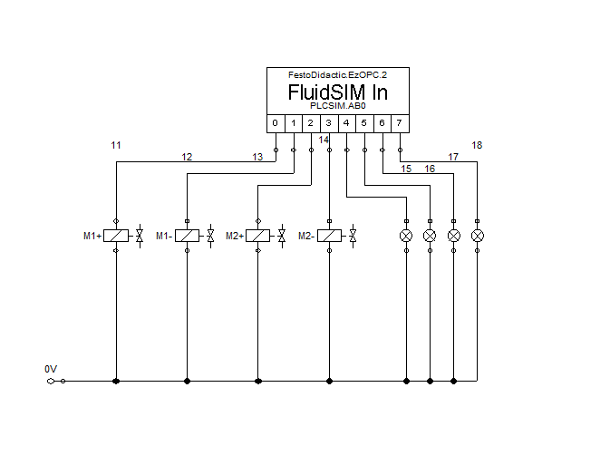
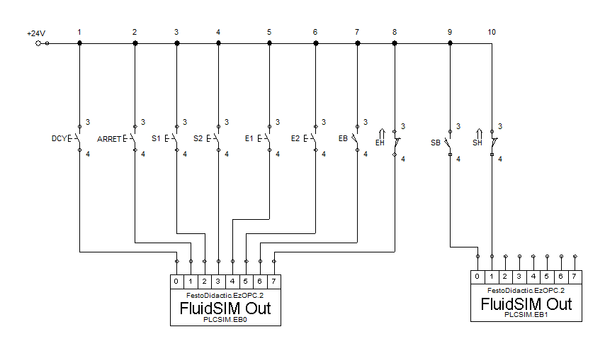
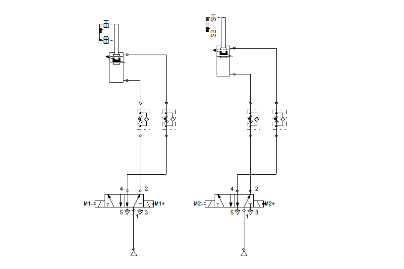
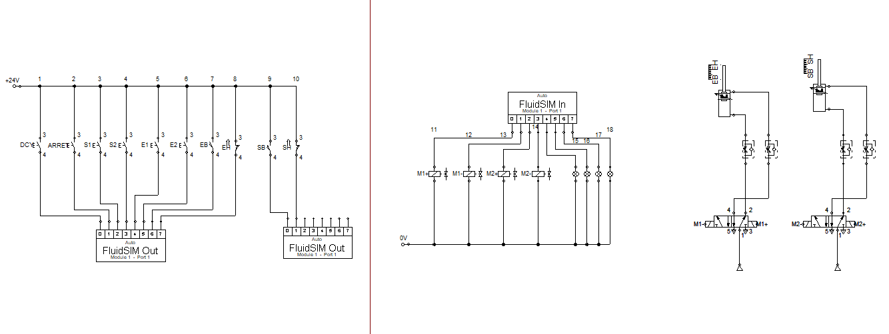
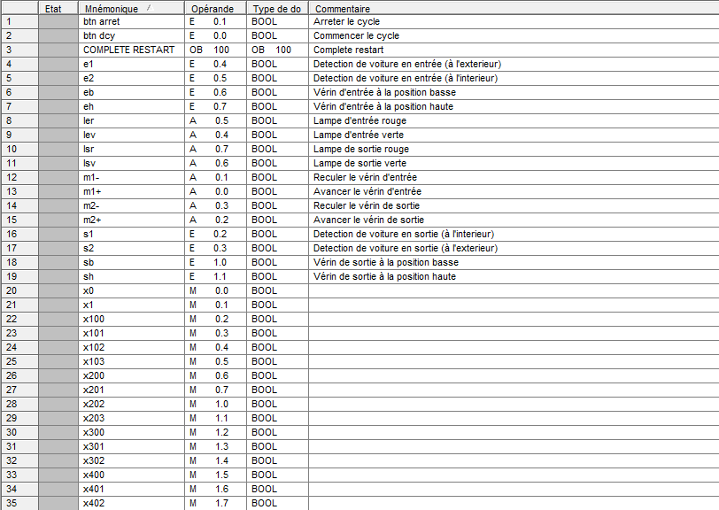
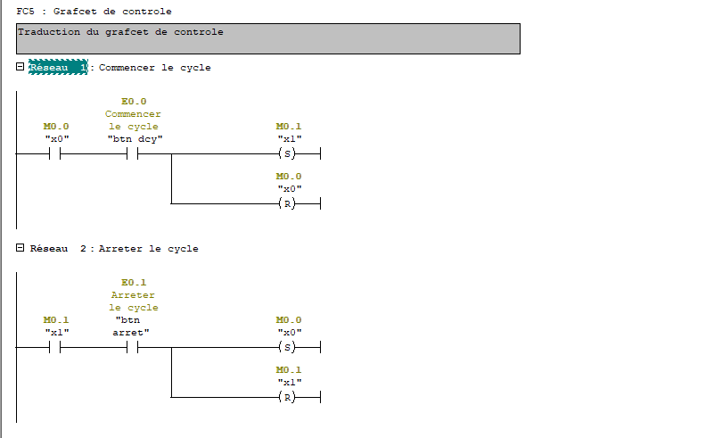

# Rapport: Conception d’un Système Automatisé

## Mise en oeuvre Step7 / FluidSim

## Projet: Station de Voitures Automatisée

**Réalisé par:** _ELMADI Choaib_, _ELHAZMIRI Ayoub_

**Filière:** _SEECS - 1_

**Encadré par:** _M. A. TAJER_

 

## I. Explication du projet:

L'idée principale est de développer un système automatisé pour réguler efficacement le flux de véhicules entrant et sortant d'une station. L'objectif principal est d'améliorer l'efficacité et de réduire les interventions manuelles, en offrant une solution pratique pour la gestion des stations de voitures.

## II. Cahier de charge:

Le projet vise à concevoir une station de gestion du flux de voitures entrant et sortant d'une station. Une représentation globale du système est décrite ci-dessous.

Le système est constitué des éléments suivants:

- Une barrière d’entrée contrôlée par un vérin _M1_. Les commandes du vérin sont _M1+_ et _M1-_ et ses positions sont _eb_ et _eh_.

- Une barrière de sortie contrôlée par un vérin _M2_. Les commandes du vérin sont _M2+_ et _M2-_ et ses positions sont _sb_ et _sh_.

- Deux détecteurs de présence _e1_ et _e2_ à l’entrée.

- Deux détecteurs de présence _s1_ et _s2_ à la sortie.

- Deux lampes _Lev_ et _Ler_ à l’entrée pour visualiser la possibilité d’entrer à la station. La lampe verte _Lev_ est allumée si la barrière est ouverte en totalité, et la lampe rouge _Ler_ est allumée si la barrière n’est pas ouverte ou la station est pleine.

- Deux lampes _Lsv_ et _Lsr_ à la sortie pour visualiser la possibilité de sortir de la station. La lampe verte _Lsv_ est allumée si la barrière est ouverte en totalité, et la lampe rouge _Lsr_ est allumée si la barrière n’est pas ouverte.

- On considère qu’on a un bouton _dcy_ pour commencer le cycle.

## III. Cycle de fonctionnement:

- Les voitures arrivent à l’entrée de la station.

- Une fois une voiture est détectée par _e1_, à condition que _M1_ est dans la position _eh_ et à condition que la station n’est pas pleine, le vérin _M1_ va à la position _eb_ par l’action _M1-_.

- La lampe _Ler_ est initialement activée. Maintenant, elle est désactivée et la lampe _Lev_ est activée. Une voiture entre.

- Le capteur _e2_ détecte l’entrée d’une voiture. _Lev_ est désactivée et _Ler_ est activée. _M1_ va à la position _eh_ par l’action _M1+_. Le compteur des voitures entrées est incrémenté.

- Même logique à la sortie de la station, cette fois, le compteur est décrémenté à chaque sortie de voiture.

## IV. Conception du système:

### 1. Les entrées et les sorties:

**Les entrées:**  
Bouton _DCY_  
Capteurs de position: _e1_, _e2_, _s1_, _s2_  
Capteurs de position: _eb_, _eh_, _sb_, _sh_

**Les sorties:**  
Les vérins: _m1+_, _m1-_, _m2+_, _m2-_
Les lampes: _Ler_, _Lev_, _Lsr_, _Lsv_

### 2. Les grafcets:

### 3. Circuit sur FluidSim:

- **FluidSim In:** (Recevoir les commandes)

- **FluidSim Out:** (Envoyer les commandes)

- **Les vérins:** (Visualiser les changements du système)

et voici le circuit final:

### 4. Programmation sur Step7:

- **Mnémoniques:**

- **Traduction du grafcet de contrôle:**

### Merci de consulter la simulation (vidéo):
